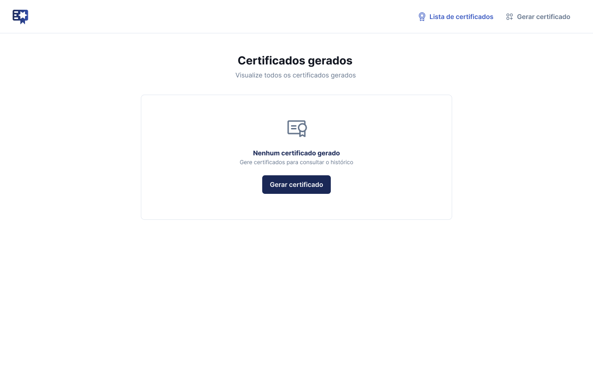

<p align="center">
  <a href="#">
    📜 Geração de Certificados
  </a>
</p>

<p align="justify">

Aplicação web desenvolvida em **Angular** durante o **curso de Angular da Rocketseat**, com foco em boas práticas de desenvolvimento e componentização.  
O sistema permite cadastrar alunos, adicionar atividades e gerar certificados automaticamente, além de consultar o histórico de certificados já emitidos.

</p>

🔗 **Links úteis**

* 🎨 [Protótipo no Figma](https://www.figma.com/design/1F8zPnBBppQo3eyWzrBjOZ/Gest%C3%A3o-de-Certificados--Community---Copy-?t=3nSu6Q44gT0Awa8C-0)
* 🚀 [Projeto em Produção]()


## 🚀 Funcionalidades

* Cadastro de certificados com **nome do aluno** e **lista de atividades**.
* Inclusão e exclusão dinâmica de atividades.
* Listagem de certificados já emitidos.
* Visualização individual de cada certificado.
* Interface moderna e responsiva.


## 📸 Screenshots

### 🔹 Geração de Certificado



### 🔹 Lista de Certificados


## 🛠️ Tecnologias Utilizadas

* [Angular](https://angular.io/)
* [TypeScript](https://www.typescriptlang.org/)
* [RxJS](https://rxjs.dev/)
* [HTML5 e CSS3](https://developer.mozilla.org/pt-BR/docs/Web)
* [Bootstrap](https://getbootstrap.com/)

## 🚀 Como executar o projeto

### Pré-requisitos

<p align="justify">Antes de começar, você vai precisar ter instalado em sua máquina as seguintes ferramentas:</p>

<a href="https://skillicons.dev">
  
</a>


### 🛠️ Como usar

Siga os passos abaixo para executar o projeto localmente:

```bash
# Clone o repositório
git clone https://github.com/Gelzieny/gerador-cetificado.git

# Acesse a pasta do projeto
cd gerador-cetificado.git

# Instale as dependências
npm install

# Execute a aplicação
ng serve

# Abra o navegador e acesse
http://localhost:4200
```

# 🧑🏻‍💻 Autor

Feito com ❤️ por Gelzieny R. Martins 👋🏽 [Entre em contato!](https://www.linkedin.com/in/gelzieny-r-martins-180551106/)

## 📝 Licença

Este projeto esta sobe a licença [MIT](./LICENSE).
